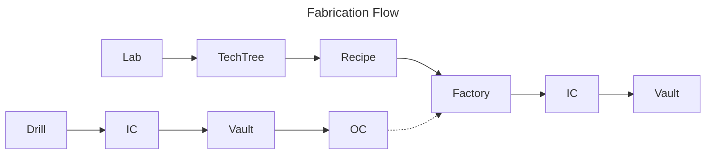
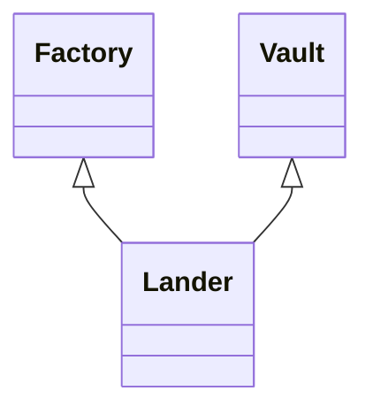

# codetorio

docker build --build-arg UID=$(id -u) --tag "codetorio" .

```mermaid
---
title: Fabrication Flow
---
graph LR
    Recipe --> Factory
    OC -.-> Factory
    Factory --> IC
    IC --> Vault
    Vault2[Vault] --> OC
    IC2[IC] --> Vault2
    Drill --> IC2
    TechTree --> Recipe
    Lab --> TechTree
```

```mermaid
classDiagram
    Factory <|-- Lander
    Vault <|-- Lander
```